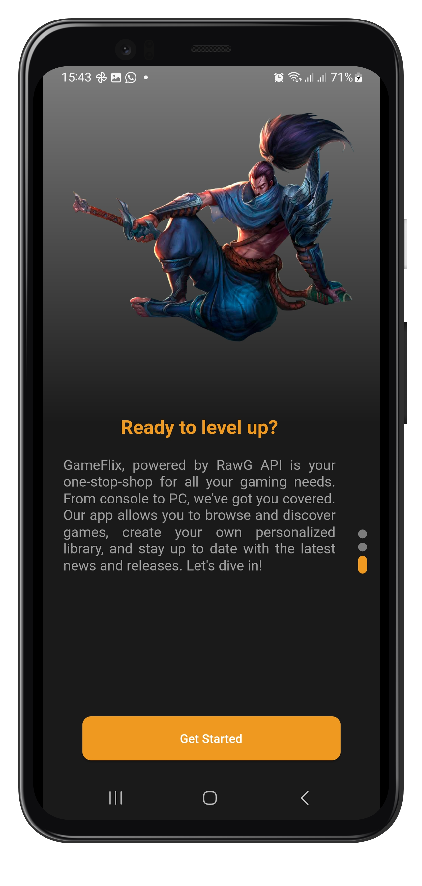
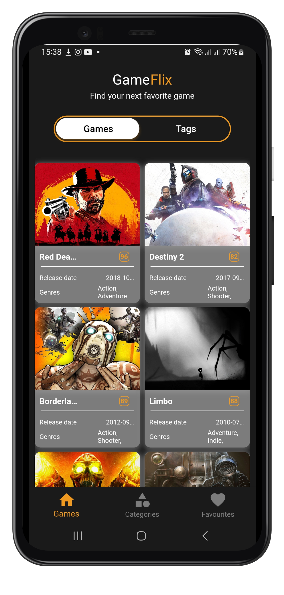
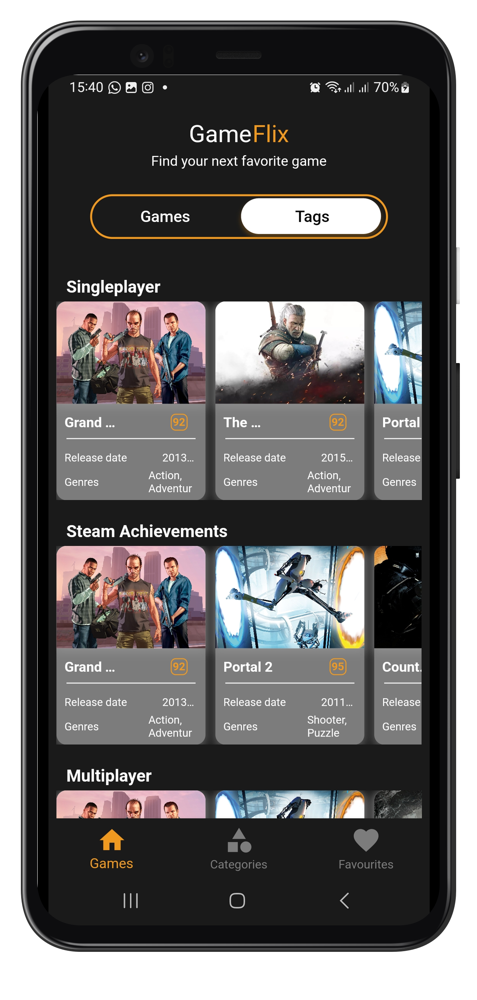
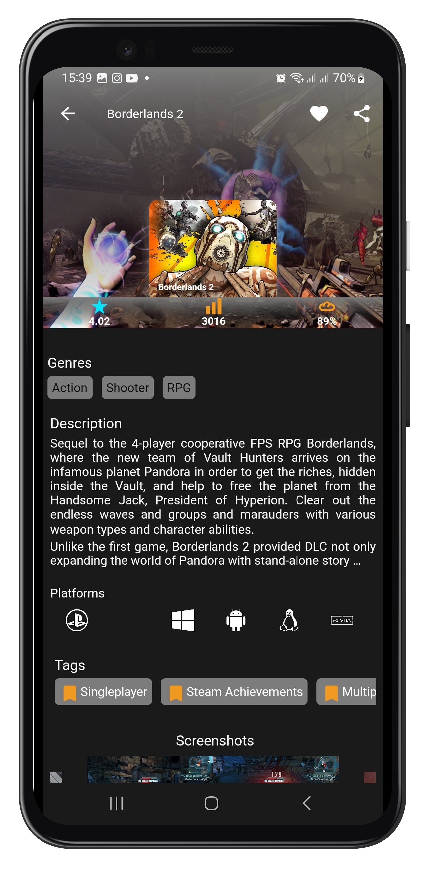
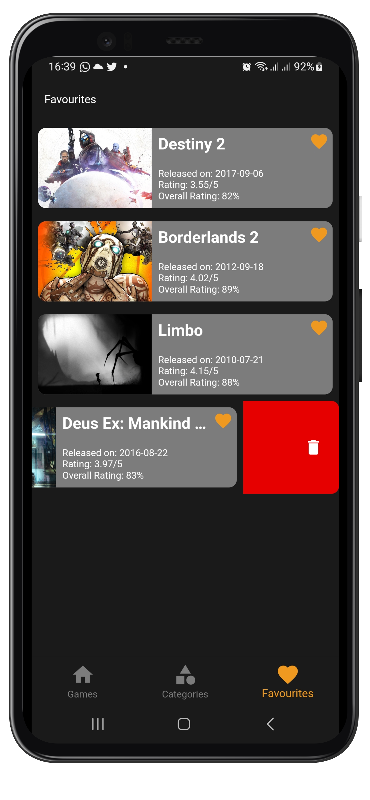

<p align="center"></p>


# GameFlix

An  app built using Flutter that consumes [RAWG API](https://rawg.io) to display current games, upcoming and popular video games 🎮and characters 🎃. It has been built following Clean Architecture Principle, Repository Pattern, MVVM Architecture in the presentation layer as well as Bloc pattern.


> ## Scroll Down to screenshots :)


## Getting Started

To run this project, 
- You need to have Flutter installed on your machine. You can find the installation guide [here](https://flutter.dev/docs/get-started/install).
- Clone this repository
- In order to be able to build the application you'll need to change the api key in `contants.dart`. First and formost you need to generate your own api key by [creating](https://rawg.com/Identity/Account/Manage) an RAWG account and [generating](https://rawg-api.com/api) an api key.
- Run `flutter pub get` to install all the dependencies
- Run `flutter pub run build_runner build ` to generate the files for floor database
- Run `flutter pub run flutter_launcher_icons:main && flutter pub run flutter_native_splash:create`
- Run `flutter run` to run the app on your device or emulator

## Disclaimer.
- Complex architectures like the pure clean architecture can also increase code complexity since decoupling your code also means creating lots of data transformations(mappers) and models, that may end up increasing the learning curve of your code to a point where it would be better to use a simpler architecture like MVVM.

- Clean arcitecture has only been used in this repository to showcase my skills and it's not recommended to use clean architecture in a small scale projects such as this one
> TAKE NOTE: This project is still under development and you may run into bugs. You may still contribute to it though. :)

So let's get started ...

## Architecture

### What is Clean Architecture?

A well planned architecture is extremely important for an app to scale and all architectures have one common goal- to manage complexity of your app. This isn't something to be worried about in smaller apps however it may prove very useful when working on apps with longer development lifecycle and a bigger team.

Clean architecture was proposed by [Robert C. Martin](https://en.wikipedia.org/wiki/Robert_C._Martin) in 2012 in the [Clean Code Blog](http://blog.cleancoder.com/uncle-bob/2012/08/13/the-clean-architecture.html) and it follow the SOLID principle.

This app is built upon Clean Architecture. The architecture is divided into 3 layers:


- **Data Layer**: This layer contains all the data sources and repositories. It also contains the models for the data.
- **Domain Layer**: This layer contains the use cases and the entities.
- **Presentation Layer**: This layer contains the UI and the BLoC.

The center circle is the most abstract, and the outer circle is the most concrete. This is called the [Abstraction Principle](https://en.wikipedia.org/wiki/Abstraction_principle_(computer_programming)). The Abstraction Principle specifies that inner circles should contain business logic, and outer circles should contain implementation details.

Another principle of Clean Architecture is the [Dependency Inversion](https://en.wikipedia.org/wiki/Dependency_inversion_principle). This rule specifies that each circle can depend only on the nearest inward circle ie. low-level modules do not depend on high-level modules but the other way around.

### Why Clean Architecture?
- Loose coupling between the code - The code can easily be modified without affecting any or a large part of the app's codebase thus easier to scale the application later on.
- Easier to test code.
- Separation of Concern - Different modules have specific responsibilities making it easier for modification and maintenance.

## Layers.

### 1. Domain.
This is the core layer of the application. The ```domain``` layer is independent of any other layers thus ] domain models and business logic can be independent from other layers.This means that changes in other layers will have no effect on domain layer eg.  screen UI (presentation layer) or changing database (data layer) will not result in any code change withing domain layer.

Components of domain layer include:
- __Models__: Defines the core structure of the data that will be used within the application.

- __Repositories__: Interfaces used by the use cases. Implemented in the data layer.

- __Use cases/Interactors__: They enclose a single action, like getting data from a database or posting to a service. They use the repositories to resolve the action they are supposed to do. They usually override the operator “invoke”, so they can be called as a function.

### 2. Data.
The ```data``` layer is responsibile for selecting the proper data source for the domain layer. It contains the implementations of the repositories declared in the domain layer. 

Components of data layer include:
- __Models__

    -__Dto Models__: Defines POJO of network responses.

    -__Entity Models__: Defines the schema of SQLite database.

- __Repositories__: Responsible for exposing data to the domain layer.

- __Mappers__: They perform data transformation between ```domain```, ```dto``` and ```entity``` models.

- __Network__: This is responsible for performing network operations eg. defining API endpoints using [Retrofit](https://square.github.io/retrofit/).

- __Cache__: This is responsible for performing caching operations using [Room](https://developer.android.com/training/data-storage/room).

- __Data Source__:  Responsible for deciding which data source (network or cache) will be used when fetching data.

### 3. Presentation.
The ```presentation``` layer contains components involved in showing information to the user. This layer contains the UI and the BLoC.

## Testing

This app is built using TDD. The tests are divided into 3 layers:

- **Data Layer**: This layer contains the tests for the data sources and repositories.
- **Domain Layer**: This layer contains the tests for the use cases.
- **Presentation Layer**: This layer contains the tests for the BLoC.

## Packages

- [flutter_bloc](https://pub.dev/packages/flutter_bloc): Flutter Widgets that make it easy to integrate blocs and cubits into Flutter.
- [equatable](https://pub.dev/packages/equatable): Equatable is a Dart package that helps to implement value equality without needing to explicitly override == and hashCode.
- [dio](https://pub.dev/packages/dio): A powerful Http client for Dart, which supports Interceptors, FormData, Request Cancellation, File Downloading, Timeout etc.
- [floor](https://pub.dev/packages/floor): A persistence library for SQLite, providing an abstraction layer over SQLite to define entities and accessors for them.
- [mockito](https://pub.dev/packages/mockito): A popular mocking framework for Dart.
- [mocktail](https://pub.dev/packages/mocktail): A popular mocking framework for Dart.
- [cached_network_image](https://pub.dev/packages/cached_network_image): A Flutter library to load and cache network images.
- [flutter_test](https://pub.dev/packages/flutter_test): Flutter testing support.
- [block_test](https://pub.dev/packages/bloc_test): A testing library that makes it easy to test blocs and cubits.
- [logger](https://pub.dev/packages/logger): A simple logging utility with support for multiple log levels, ANSI colors, line numbers, printing to console, file and custom output.
- [dartz](https://pub.dev/packages/dartz): Functional programming in Dart.
- [get_it](https://pub.dev/packages/get_it): A simple Service Locator for Dart and Flutter projects with some additional goodies.
- [flutter_native_splash](https://pub.dev/packages/flutter_native_splash): When your app is opened, there is a brief time while the native app loads Flutter. By default, during this time, the native app displays a white splash screen. This package automatically generates iOS, Android, and Web-native code for customizing this native splash screen background color and splash image. Supports dark mode, full screen, and platform-specific options.
- [flutter_launcher_icons](https://pub.dev/packages/flutter_launcher_icons) : A package which simplifies the task of updating your Flutter app's launcher icon.
- [shared_preferences](https://pub.dev/packages/shared_preferences) : Flutter plugin for reading and writing simple key-value pairs. Wraps NSUserDefaults on iOS and SharedPreferences on Android.
- [flutter_spinkit](https://pub.dev/packages/flutter_spinkit) : A collection of loading indicators animated with flutter. Heavily inspired by @tobiasahlin's SpinKit.


## Screenshots

<center>
  <table>
    <tr>
        <td></td>
        <td></td>   
        <td></td> 
    </tr>  
    <tr>
         <td></td> 
         <td></td> 
         <td></td>  
    </tr>
    <tr>
         <td></td>
         <td></td>
         <td></td>
    </tr>
    <tr>
         <td></td>
         <td></td>
         <td></td>
    </tr>
  </table>
</center>


## Resources

- [Clean Architecture](https://blog.cleancoder.com/uncle-bob/2012/08/13/the-clean-architecture.html)
- [TDD](https://www.youtube.com/watch?v=KtHQGs3mSfM)

You found a bug? Please file an issue
